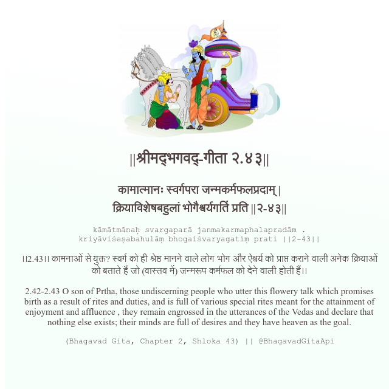

<h2>||श्रीमद्‍भगवद्‍-गीता २.४३||</h2>
<h3>कामात्मानः स्वर्गपरा जन्मकर्मफलप्रदाम् | क्रियाविशेषबहुलां भोगैश्वर्यगतिं प्रति ||२-४३||</h3>
<pre>kāmātmānaḥ svargaparā janmakarmaphalapradām . kriyāviśeṣabahulāṃ bhogaiśvaryagatiṃ prati ||2-43||</pre>

।।2.43।। कामनाओं से युक्त? स्वर्ग को ही श्रेष्ठ मानने वाले लोग भोग और ऐश्वर्य को प्राप्त कराने वाली अनेक क्रियाओं को बताते हैं जो (वास्तव में) जन्मरूप कर्मफल को देने वाली होती हैं।।

<pre>(Bhagavad Gita, Chapter 2, Shloka 43) || @BhagavadGitaApi</pre>
https://vedicscriptures.github.io/

#API #bhagavadgitaapi #slok #nodejs #js #api #gitaapi #krishna #hinduism #vedic #ISKCON #shreemadbhagavadgita #technology

