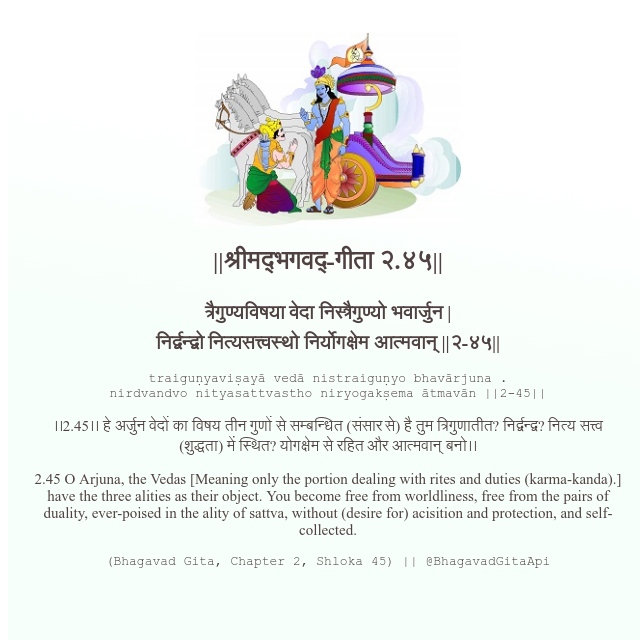

<h2>||श्रीमद्‍भगवद्‍-गीता २.४५||</h2>
<h3>त्रैगुण्यविषया वेदा निस्त्रैगुण्यो भवार्जुन | निर्द्वन्द्वो नित्यसत्त्वस्थो निर्योगक्षेम आत्मवान् ||२-४५||</h3>
<pre>traiguṇyaviṣayā vedā nistraiguṇyo bhavārjuna . nirdvandvo nityasattvastho niryogakṣema ātmavān ||2-45||</pre>

।।2.45।। हे अर्जुन  वेदों का विषय तीन गुणों से सम्बन्धित (संसार से) है  तुम त्रिगुणातीत? निर्द्वन्द्व? नित्य सत्त्व (शुद्धता) में स्थित? योगक्षेम से रहित और आत्मवान् बनो।।

<pre>(Bhagavad Gita, Chapter 2, Shloka 45) || @BhagavadGitaApi</pre>
https://vedicscriptures.github.io/

#API #bhagavadgitaapi #slok #nodejs #js #api #gitaapi #krishna #hinduism #vedic #ISKCON #shreemadbhagavadgita #technology

