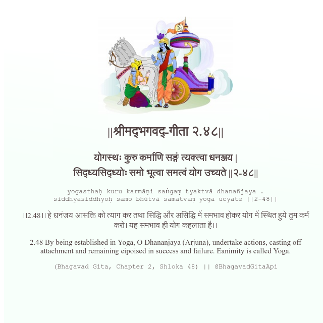

<h2>||श्रीमद्‍भगवद्‍-गीता २.४८||</h2>
<h3>योगस्थः कुरु कर्माणि सङ्गं त्यक्त्वा धनञ्जय | सिद्ध्यसिद्ध्योः समो भूत्वा समत्वं योग उच्यते ||२-४८||</h3>
<pre>yogasthaḥ kuru karmāṇi saṅgaṃ tyaktvā dhanañjaya . siddhyasiddhyoḥ samo bhūtvā samatvaṃ yoga ucyate ||2-48||</pre>

।।2.48।। हे धनंजय  आसक्ति को त्याग कर तथा सिद्धि और असिद्धि में समभाव होकर योग में स्थित हुये तुम कर्म करो। यह समभाव ही योग कहलाता है।।

<pre>(Bhagavad Gita, Chapter 2, Shloka 48) || @BhagavadGitaApi</pre>
https://bhagavadgitaapi.in/

#API #bhagavadgitaapi #slok #nodejs #js #api #gitaapi #krishna #hinduism #vedic #ISKCON #shreemadbhagavadgita #technology

