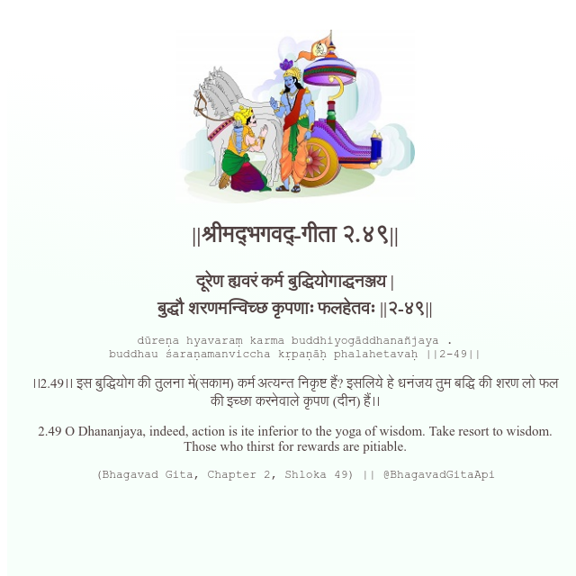

<h2>||श्रीमद्‍भगवद्‍-गीता २.४९||</h2>
<h3>दूरेण ह्यवरं कर्म बुद्धियोगाद्धनञ्जय | बुद्धौ शरणमन्विच्छ कृपणाः फलहेतवः ||२-४९||</h3>
<pre>dūreṇa hyavaraṃ karma buddhiyogāddhanañjaya . buddhau śaraṇamanviccha kṛpaṇāḥ phalahetavaḥ ||2-49||</pre>

।।2.49।। इस बुद्धियोग की तुलना में(सकाम) कर्म अत्यन्त निकृष्ट हैं? इसलिये हे धनंजय  तुम बद्धि की शरण लो फल की इच्छा करनेवाले कृपण (दीन) हैं।।

<pre>(Bhagavad Gita, Chapter 2, Shloka 49) || @BhagavadGitaApi</pre>
https://vedicscriptures.github.io/

#API #bhagavadgitaapi #slok #nodejs #js #api #gitaapi #krishna #hinduism #vedic #ISKCON #shreemadbhagavadgita #technology

