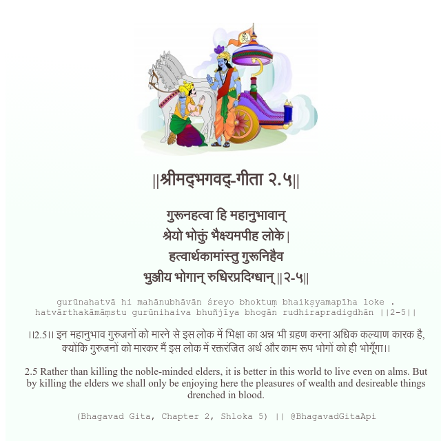

<h2>||श्रीमद्‍भगवद्‍-गीता २.५||</h2>
<h3>गुरूनहत्वा हि महानुभावान् श्रेयो भोक्तुं भैक्ष्यमपीह लोके | हत्वार्थकामांस्तु गुरूनिहैव भुञ्जीय भोगान् रुधिरप्रदिग्धान् ||२-५||</h3>
<pre>gurūnahatvā hi mahānubhāvān śreyo bhoktuṃ bhaikṣyamapīha loke . hatvārthakāmāṃstu gurūnihaiva bhuñjīya bhogān rudhirapradigdhān ||2-5||</pre>

।।2.5।। इन महानुभाव गुरुजनों को मारने से इस लोक में भिक्षा का अन्न भी ग्रहण करना अधिक कल्याण कारक है, क्योंकि गुरुजनों को मारकर मैं इस लोक में रक्तरंजित अर्थ और काम रूप भोगों को ही भोगूँगा।।

<pre>(Bhagavad Gita, Chapter 2, Shloka 5) || @BhagavadGitaApi</pre>
https://docs.bhagavadgitaapi.in/

#API #bhagavadgitaapi #slok #nodejs #js #api #gitaapi #krishna #hinduism #vedic #ISKCON #shreemadbhagavadgita #technology

