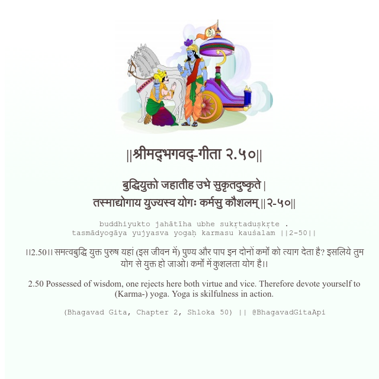

<h2>||श्रीमद्‍भगवद्‍-गीता २.५०||</h2>
<h3>बुद्धियुक्तो जहातीह उभे सुकृतदुष्कृते | तस्माद्योगाय युज्यस्व योगः कर्मसु कौशलम् ||२-५०||</h3>
<pre>buddhiyukto jahātīha ubhe sukṛtaduṣkṛte . tasmādyogāya yujyasva yogaḥ karmasu kauśalam ||2-50||</pre>

।।2.50।। समत्वबुद्धि युक्त पुरुष यहां (इस जीवन में) पुण्य और पाप इन दोनों कर्मों को त्याग देता है? इसलिये तुम योग से युक्त हो जाओ। कर्मों में कुशलता योग है।।

<pre>(Bhagavad Gita, Chapter 2, Shloka 50) || @BhagavadGitaApi</pre>
https://docs.bhagavadgitaapi.in/

#API #bhagavadgitaapi #slok #nodejs #js #api #gitaapi #krishna #hinduism #vedic #ISKCON #shreemadbhagavadgita #technology

