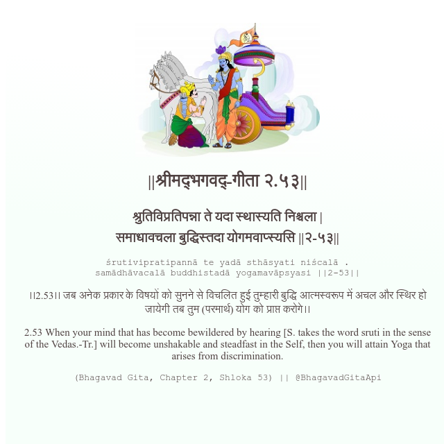

<h2>||श्रीमद्‍भगवद्‍-गीता २.५३||</h2>
<h3>श्रुतिविप्रतिपन्ना ते यदा स्थास्यति निश्चला | समाधावचला बुद्धिस्तदा योगमवाप्स्यसि ||२-५३||</h3>
<pre>śrutivipratipannā te yadā sthāsyati niścalā . samādhāvacalā buddhistadā yogamavāpsyasi ||2-53||</pre>

।।2.53।। जब अनेक प्रकार के विषयों को सुनने से विचलित हुई तुम्हारी बुद्धि आत्मस्वरूप में अचल और स्थिर हो जायेगी तब तुम (परमार्थ) योग को प्राप्त करोगे।।

<pre>(Bhagavad Gita, Chapter 2, Shloka 53) || @BhagavadGitaApi</pre>
https://bhagavadgitaapi.in/

#API #bhagavadgitaapi #slok #nodejs #js #api #gitaapi #krishna #hinduism #vedic #ISKCON #shreemadbhagavadgita #technology

