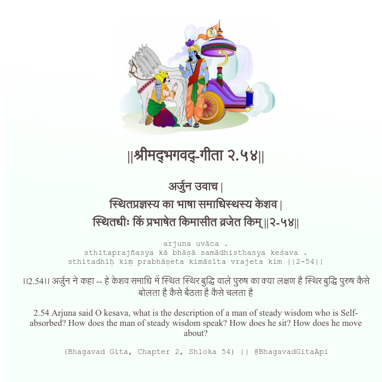

<h2>||श्रीमद्‍भगवद्‍-गीता २.५४||</h2>
<h3>अर्जुन उवाच | स्थितप्रज्ञस्य का भाषा समाधिस्थस्य केशव | स्थितधीः किं प्रभाषेत किमासीत व्रजेत किम् ||२-५४||</h3>
<pre>arjuna uvāca . sthitaprajñasya kā bhāṣā samādhisthasya keśava . sthitadhīḥ kiṃ prabhāṣeta kimāsīta vrajeta kim ||2-54||</pre>

।।2.54।। अर्जुन ने कहा -- हे केशव  समाधि में स्थित स्थिर बुद्धि वाले पुरुष का क्या लक्षण है स्थिर बुद्धि पुरुष कैसे बोलता है कैसे बैठता है  कैसे चलता है

<pre>(Bhagavad Gita, Chapter 2, Shloka 54) || @BhagavadGitaApi</pre>
https://docs.bhagavadgitaapi.in/

#API #bhagavadgitaapi #slok #nodejs #js #api #gitaapi #krishna #hinduism #vedic #ISKCON #shreemadbhagavadgita #technology

