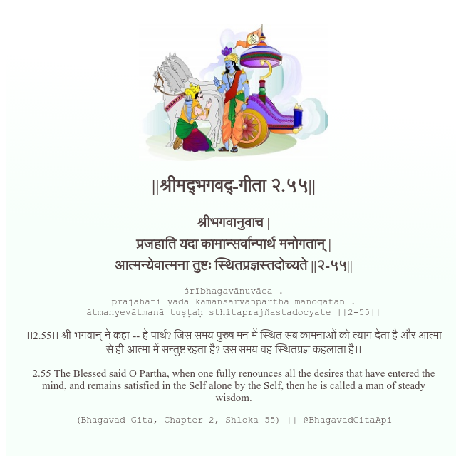

<h2>||श्रीमद्‍भगवद्‍-गीता २.५५||</h2>
<h3>श्रीभगवानुवाच | प्रजहाति यदा कामान्सर्वान्पार्थ मनोगतान् | आत्मन्येवात्मना तुष्टः स्थितप्रज्ञस्तदोच्यते ||२-५५||</h3>
<pre>śrībhagavānuvāca . prajahāti yadā kāmānsarvānpārtha manogatān . ātmanyevātmanā tuṣṭaḥ sthitaprajñastadocyate ||2-55||</pre>

।।2.55।। श्री भगवान् ने कहा -- हे पार्थ? जिस समय पुरुष मन में स्थित सब कामनाओं को त्याग देता है और आत्मा से ही आत्मा में सन्तुष्ट रहता है? उस समय वह स्थितप्रज्ञ कहलाता है।।

<pre>(Bhagavad Gita, Chapter 2, Shloka 55) || @BhagavadGitaApi</pre>
https://bhagavadgitaapi.in/

#API #bhagavadgitaapi #slok #nodejs #js #api #gitaapi #krishna #hinduism #vedic #ISKCON #shreemadbhagavadgita #technology

