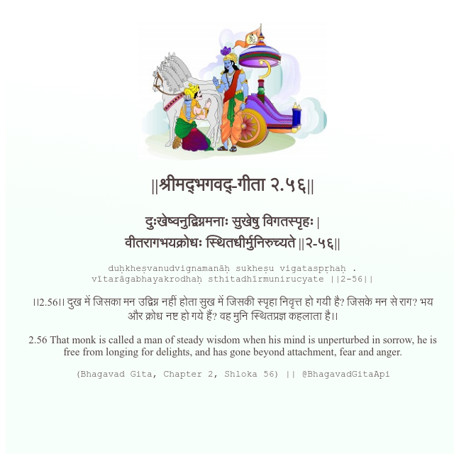

<h2>||श्रीमद्‍भगवद्‍-गीता २.५६||</h2>
<h3>दुःखेष्वनुद्विग्नमनाः सुखेषु विगतस्पृहः | वीतरागभयक्रोधः स्थितधीर्मुनिरुच्यते ||२-५६||</h3>
<pre>duḥkheṣvanudvignamanāḥ sukheṣu vigataspṛhaḥ . vītarāgabhayakrodhaḥ sthitadhīrmunirucyate ||2-56||</pre>

।।2.56।। दुख में जिसका मन उद्विग्न नहीं होता सुख में जिसकी स्पृहा निवृत्त हो गयी है? जिसके मन से राग? भय और क्रोध नष्ट हो गये हैं? वह मुनि स्थितप्रज्ञ कहलाता है।।

<pre>(Bhagavad Gita, Chapter 2, Shloka 56) || @BhagavadGitaApi</pre>
https://bhagavadgitaapi.in/

#API #bhagavadgitaapi #slok #nodejs #js #api #gitaapi #krishna #hinduism #vedic #ISKCON #shreemadbhagavadgita #technology

