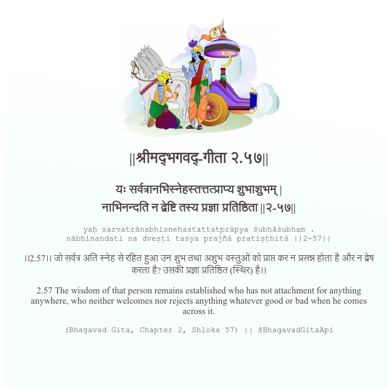

<h2>||श्रीमद्‍भगवद्‍-गीता २.५७||</h2>
<h3>यः सर्वत्रानभिस्नेहस्तत्तत्प्राप्य शुभाशुभम् | नाभिनन्दति न द्वेष्टि तस्य प्रज्ञा प्रतिष्ठिता ||२-५७||</h3>
<pre>yaḥ sarvatrānabhisnehastattatprāpya śubhāśubham . nābhinandati na dveṣṭi tasya prajñā pratiṣṭhitā ||2-57||</pre>

।।2.57।। जो सर्वत्र अति स्नेह से रहित हुआ उन शुभ तथा अशुभ वस्तुओं को प्राप्त कर न प्रसन्न होता है और न द्वेष करता है? उसकी प्रज्ञा प्रतिष्ठित (स्थिर) है।।

<pre>(Bhagavad Gita, Chapter 2, Shloka 57) || @BhagavadGitaApi</pre>
https://docs.bhagavadgitaapi.in/

#API #bhagavadgitaapi #slok #nodejs #js #api #gitaapi #krishna #hinduism #vedic #ISKCON #shreemadbhagavadgita #technology

