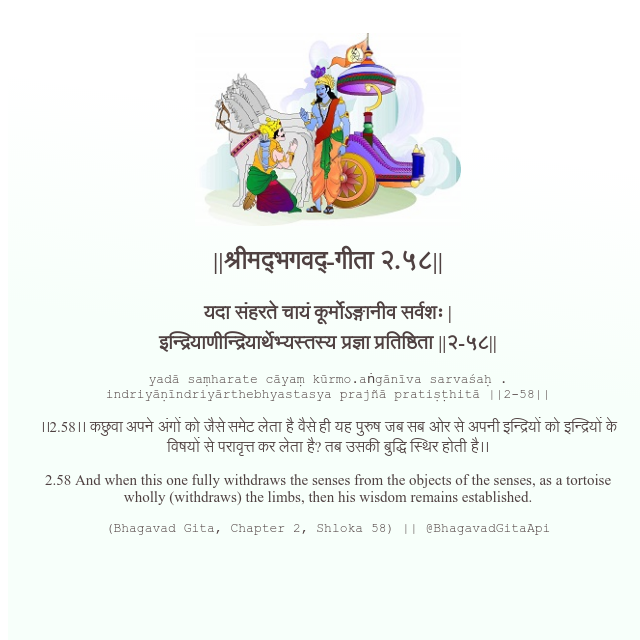

<h2>||श्रीमद्‍भगवद्‍-गीता २.५८||</h2>
<h3>यदा संहरते चायं कूर्मोऽङ्गानीव सर्वशः | इन्द्रियाणीन्द्रियार्थेभ्यस्तस्य प्रज्ञा प्रतिष्ठिता ||२-५८||</h3>
<pre>yadā saṃharate cāyaṃ kūrmo.aṅgānīva sarvaśaḥ . indriyāṇīndriyārthebhyastasya prajñā pratiṣṭhitā ||2-58||</pre>

।।2.58।। कछुवा अपने अंगों को जैसे समेट लेता है वैसे ही यह पुरुष जब सब ओर से अपनी इन्द्रियों को इन्द्रियों के विषयों से परावृत्त कर लेता है? तब उसकी बुद्धि स्थिर होती है।।

<pre>(Bhagavad Gita, Chapter 2, Shloka 58) || @BhagavadGitaApi</pre>
https://bhagavadgitaapi.in/

#API #bhagavadgitaapi #slok #nodejs #js #api #gitaapi #krishna #hinduism #vedic #ISKCON #shreemadbhagavadgita #technology

