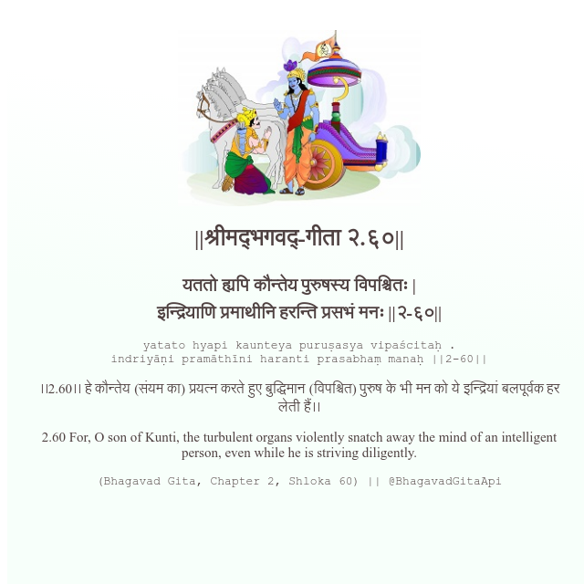

<h2>||श्रीमद्‍भगवद्‍-गीता २.६०||</h2>
<h3>यततो ह्यपि कौन्तेय पुरुषस्य विपश्चितः | इन्द्रियाणि प्रमाथीनि हरन्ति प्रसभं मनः ||२-६०||</h3>
<pre>yatato hyapi kaunteya puruṣasya vipaścitaḥ . indriyāṇi pramāthīni haranti prasabhaṃ manaḥ ||2-60||</pre>

।।2.60।। हे कौन्तेय  (संयम का) प्रयत्न करते हुए बुद्धिमान (विपश्चित) पुरुष के भी मन को ये इन्द्रियां बलपूर्वक हर लेती हैं।।

<pre>(Bhagavad Gita, Chapter 2, Shloka 60) || @BhagavadGitaApi</pre>
https://vedicscriptures.github.io/

#API #bhagavadgitaapi #slok #nodejs #js #api #gitaapi #krishna #hinduism #vedic #ISKCON #shreemadbhagavadgita #technology

