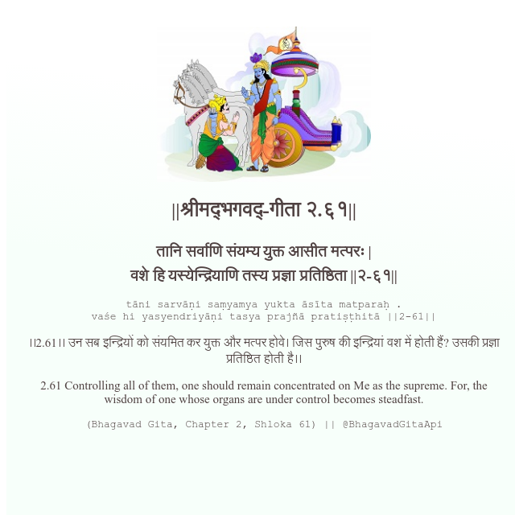

<h2>||श्रीमद्‍भगवद्‍-गीता २.६१||</h2>
<h3>तानि सर्वाणि संयम्य युक्त आसीत मत्परः | वशे हि यस्येन्द्रियाणि तस्य प्रज्ञा प्रतिष्ठिता ||२-६१||</h3>
<pre>tāni sarvāṇi saṃyamya yukta āsīta matparaḥ . vaśe hi yasyendriyāṇi tasya prajñā pratiṣṭhitā ||2-61||</pre>

।।2.61।। उन सब इन्द्रियों को संयमित कर युक्त और मत्पर होवे। जिस पुरुष की इन्द्रियां वश में होती हैं? उसकी प्रज्ञा प्रतिष्ठित होती है।।

<pre>(Bhagavad Gita, Chapter 2, Shloka 61) || @BhagavadGitaApi</pre>
https://vedicscriptures.github.io/

#API #bhagavadgitaapi #slok #nodejs #js #api #gitaapi #krishna #hinduism #vedic #ISKCON #shreemadbhagavadgita #technology

