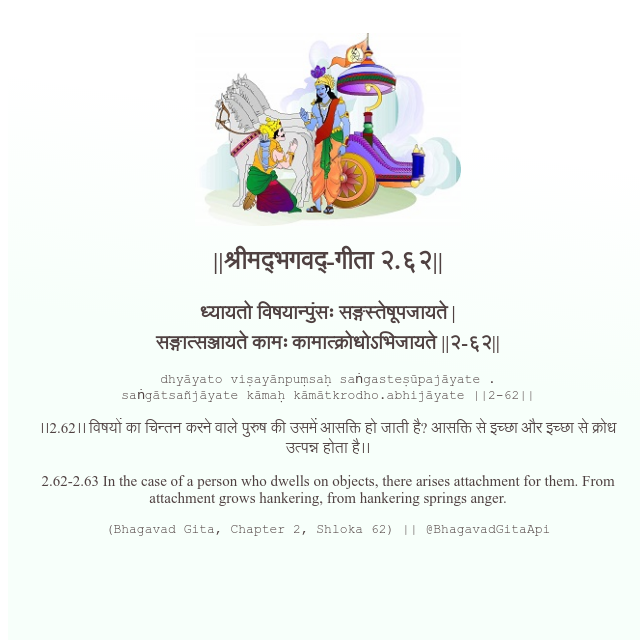

<h2>||श्रीमद्‍भगवद्‍-गीता २.६२||</h2>
<h3>ध्यायतो विषयान्पुंसः सङ्गस्तेषूपजायते | सङ्गात्सञ्जायते कामः कामात्क्रोधोऽभिजायते ||२-६२||</h3>
<pre>dhyāyato viṣayānpuṃsaḥ saṅgasteṣūpajāyate . saṅgātsañjāyate kāmaḥ kāmātkrodho.abhijāyate ||2-62||</pre>

।।2.62।। विषयों का चिन्तन करने वाले पुरुष की उसमें आसक्ति हो जाती है? आसक्ति से इच्छा और इच्छा से क्रोध उत्पन्न होता है।।

<pre>(Bhagavad Gita, Chapter 2, Shloka 62) || @BhagavadGitaApi</pre>
https://vedicscriptures.github.io/

#API #bhagavadgitaapi #slok #nodejs #js #api #gitaapi #krishna #hinduism #vedic #ISKCON #shreemadbhagavadgita #technology

