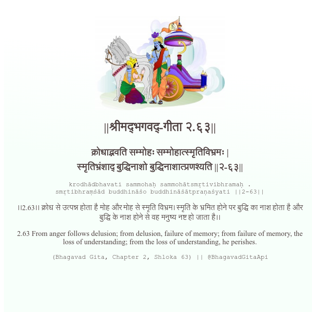

<h2>||श्रीमद्‍भगवद्‍-गीता २.६३||</h2>
<h3>क्रोधाद्भवति सम्मोहः सम्मोहात्स्मृतिविभ्रमः | स्मृतिभ्रंशाद् बुद्धिनाशो बुद्धिनाशात्प्रणश्यति ||२-६३||</h3>
<pre>krodhādbhavati sammohaḥ sammohātsmṛtivibhramaḥ . smṛtibhraṃśād buddhināśo buddhināśātpraṇaśyati ||2-63||</pre>

।।2.63।। क्रोध से उत्पन्न होता है मोह और मोह से स्मृति विभ्रम। स्मृति के भ्रमित होने पर बुद्धि का नाश होता है और बुद्धि के नाश होने से वह मनुष्य नष्ट हो जाता है।।

<pre>(Bhagavad Gita, Chapter 2, Shloka 63) || @BhagavadGitaApi</pre>
https://docs.bhagavadgitaapi.in/

#API #bhagavadgitaapi #slok #nodejs #js #api #gitaapi #krishna #hinduism #vedic #ISKCON #shreemadbhagavadgita #technology

