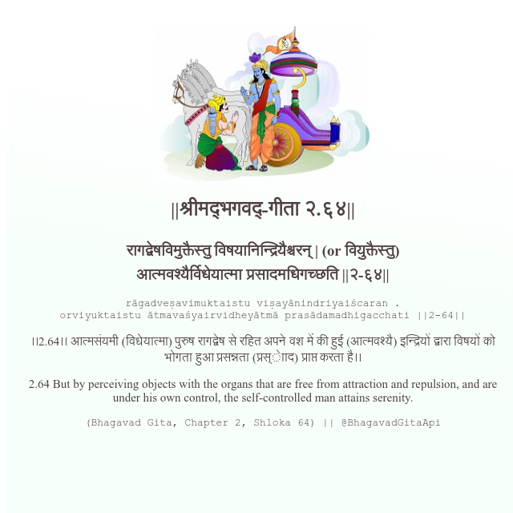

<h2>||श्रीमद्‍भगवद्‍-गीता २.६४||</h2>
<h3>रागद्वेषविमुक्तैस्तु विषयानिन्द्रियैश्चरन् | (or वियुक्तैस्तु) आत्मवश्यैर्विधेयात्मा प्रसादमधिगच्छति ||२-६४||</h3>
<pre>rāgadveṣavimuktaistu viṣayānindriyaiścaran . orviyuktaistu ātmavaśyairvidheyātmā prasādamadhigacchati ||2-64||</pre>

।।2.64।। आत्मसंयमी (विधेयात्मा) पुरुष रागद्वेष से रहित अपने वश में की हुई (आत्मवश्यै) इन्द्रियों द्वारा विषयों को भोगता हुआ प्रसन्नता (प्रस्ेााद) प्राप्त करता है।।

<pre>(Bhagavad Gita, Chapter 2, Shloka 64) || @BhagavadGitaApi</pre>
https://docs.bhagavadgitaapi.in/

#API #bhagavadgitaapi #slok #nodejs #js #api #gitaapi #krishna #hinduism #vedic #ISKCON #shreemadbhagavadgita #technology

