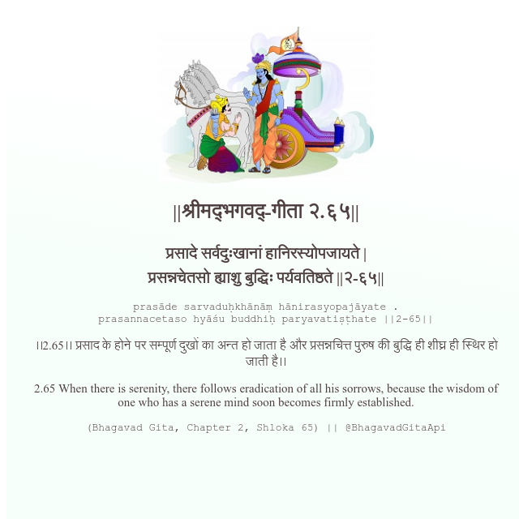

<h2>||श्रीमद्‍भगवद्‍-गीता २.६५||</h2>
<h3>प्रसादे सर्वदुःखानां हानिरस्योपजायते | प्रसन्नचेतसो ह्याशु बुद्धिः पर्यवतिष्ठते ||२-६५||</h3>
<pre>prasāde sarvaduḥkhānāṃ hānirasyopajāyate . prasannacetaso hyāśu buddhiḥ paryavatiṣṭhate ||2-65||</pre>

।।2.65।। प्रसाद के होने पर सम्पूर्ण दुखों का अन्त हो जाता है और प्रसन्नचित्त पुरुष की बुद्धि ही शीघ्र ही स्थिर हो जाती है।।

<pre>(Bhagavad Gita, Chapter 2, Shloka 65) || @BhagavadGitaApi</pre>
https://vedicscriptures.github.io/

#API #bhagavadgitaapi #slok #nodejs #js #api #gitaapi #krishna #hinduism #vedic #ISKCON #shreemadbhagavadgita #technology

