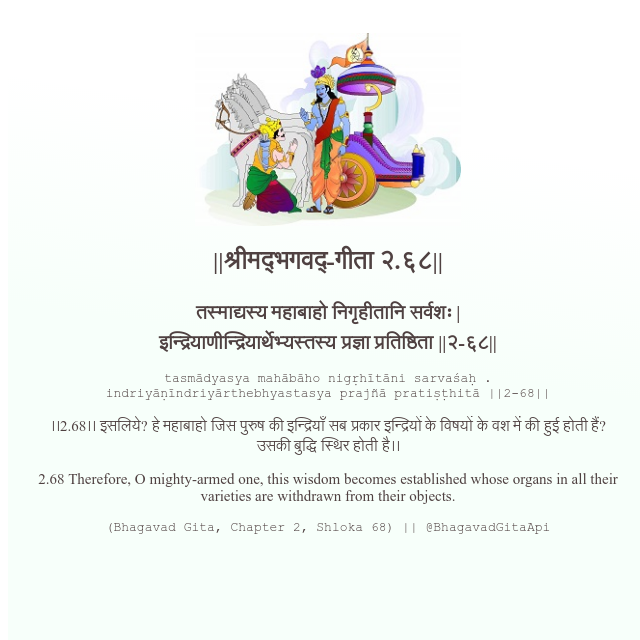

<h2>||श्रीमद्‍भगवद्‍-गीता २.६८||</h2>
<h3>तस्माद्यस्य महाबाहो निगृहीतानि सर्वशः | इन्द्रियाणीन्द्रियार्थेभ्यस्तस्य प्रज्ञा प्रतिष्ठिता ||२-६८||</h3>
<pre>tasmādyasya mahābāho nigṛhītāni sarvaśaḥ . indriyāṇīndriyārthebhyastasya prajñā pratiṣṭhitā ||2-68||</pre>

।।2.68।। इसलिये? हे महाबाहो  जिस पुरुष की इन्द्रियाँ सब प्रकार इन्द्रियों के विषयों के वश में की हुई होती हैं? उसकी बुद्धि स्थिर होती है।।

<pre>(Bhagavad Gita, Chapter 2, Shloka 68) || @BhagavadGitaApi</pre>
https://bhagavadgitaapi.in/

#API #bhagavadgitaapi #slok #nodejs #js #api #gitaapi #krishna #hinduism #vedic #ISKCON #shreemadbhagavadgita #technology

