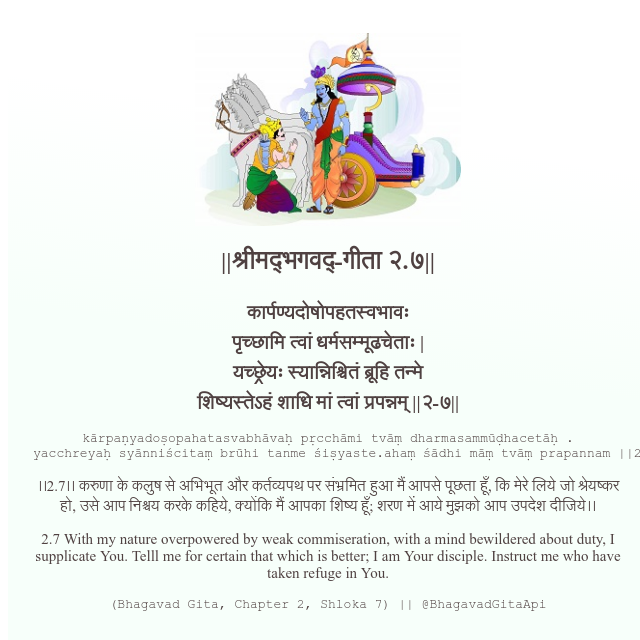

<h2>||श्रीमद्‍भगवद्‍-गीता २.७||</h2>
<h3>कार्पण्यदोषोपहतस्वभावः पृच्छामि त्वां धर्मसम्मूढचेताः | यच्छ्रेयः स्यान्निश्चितं ब्रूहि तन्मे शिष्यस्तेऽहं शाधि मां त्वां प्रपन्नम् ||२-७||</h3>
<pre>kārpaṇyadoṣopahatasvabhāvaḥ pṛcchāmi tvāṃ dharmasammūḍhacetāḥ . yacchreyaḥ syānniścitaṃ brūhi tanme śiṣyaste.ahaṃ śādhi māṃ tvāṃ prapannam ||2-7||</pre>

।।2.7।। करुणा के कलुष से अभिभूत और कर्तव्यपथ पर संभ्रमित हुआ मैं आपसे पूछता हूँ, कि मेरे लिये जो श्रेयष्कर हो, उसे आप निश्चय करके कहिये, क्योंकि मैं आपका शिष्य हूँ; शरण में आये मुझको आप उपदेश दीजिये।।

<pre>(Bhagavad Gita, Chapter 2, Shloka 7) || @BhagavadGitaApi</pre>
https://docs.bhagavadgitaapi.in/

#API #bhagavadgitaapi #slok #nodejs #js #api #gitaapi #krishna #hinduism #vedic #ISKCON #shreemadbhagavadgita #technology

