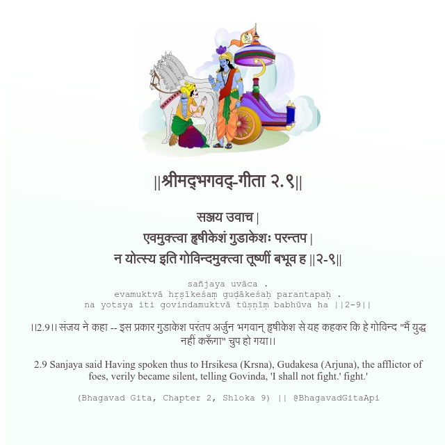

<h2>||श्रीमद्‍भगवद्‍-गीता २.९||</h2>
<h3>सञ्जय उवाच | एवमुक्त्वा हृषीकेशं गुडाकेशः परन्तप | न योत्स्य इति गोविन्दमुक्त्वा तूष्णीं बभूव ह ||२-९||</h3>
<pre>sañjaya uvāca . evamuktvā hṛṣīkeśaṃ guḍākeśaḥ parantapaḥ . na yotsya iti govindamuktvā tūṣṇīṃ babhūva ha ||2-9||</pre>

।।2.9।। संजय ने कहा -- इस प्रकार गुडाकेश परंतप अर्जुन भगवान् हृषीकेश से यह कहकर कि हे गोविन्द "मैं युद्ध नहीं करूँगा" चुप हो गया।।

<pre>(Bhagavad Gita, Chapter 2, Shloka 9) || @BhagavadGitaApi</pre>
https://vedicscriptures.github.io/

#API #bhagavadgitaapi #slok #nodejs #js #api #gitaapi #krishna #hinduism #vedic #ISKCON #shreemadbhagavadgita #technology

