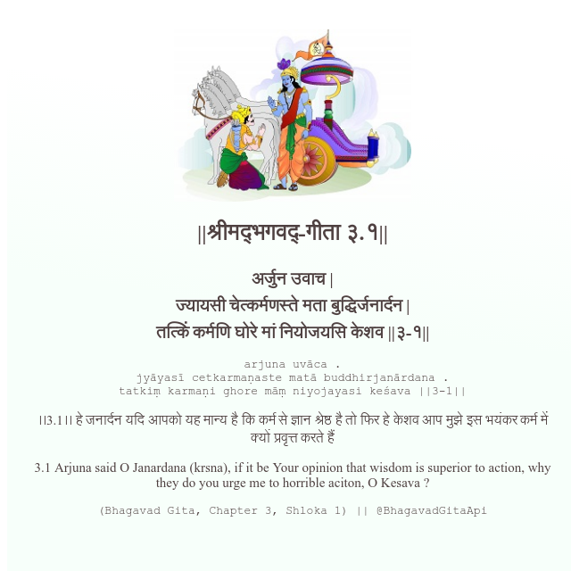

<h2>||श्रीमद्‍भगवद्‍-गीता ३.१||</h2>
<h3>अर्जुन उवाच | ज्यायसी चेत्कर्मणस्ते मता बुद्धिर्जनार्दन | तत्किं कर्मणि घोरे मां नियोजयसि केशव ||३-१||</h3>
<pre>arjuna uvāca . jyāyasī cetkarmaṇaste matā buddhirjanārdana . tatkiṃ karmaṇi ghore māṃ niyojayasi keśava ||3-1||</pre>

।।3.1।। हे जनार्दन  यदि आपको यह मान्य है कि कर्म से ज्ञान श्रेष्ठ है तो फिर हे केशव  आप मुझे इस भयंकर कर्म में क्यों प्रवृत्त करते हैं

<pre>(Bhagavad Gita, Chapter 3, Shloka 1) || @BhagavadGitaApi</pre>
https://docs.bhagavadgitaapi.in/

#API #bhagavadgitaapi #slok #nodejs #js #api #gitaapi #krishna #hinduism #vedic #ISKCON #shreemadbhagavadgita #technology

