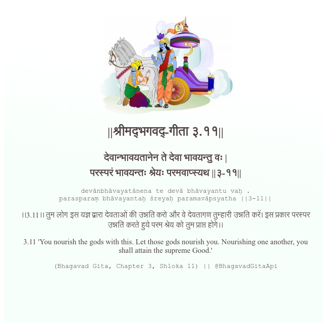

<h2>||श्रीमद्‍भगवद्‍-गीता ३.११||</h2>
<h3>देवान्भावयतानेन ते देवा भावयन्तु वः | परस्परं भावयन्तः श्रेयः परमवाप्स्यथ ||३-११||</h3>
<pre>devānbhāvayatānena te devā bhāvayantu vaḥ . parasparaṃ bhāvayantaḥ śreyaḥ paramavāpsyatha ||3-11||</pre>

।।3.11।। तुम लोग इस यज्ञ द्वारा देवताओं की उन्नति करो और वे देवतागण तुम्हारी उन्नति करें। इस प्रकार परस्पर उन्नति करते हुये परम श्रेय को तुम प्राप्त होगे।।

<pre>(Bhagavad Gita, Chapter 3, Shloka 11) || @BhagavadGitaApi</pre>
https://vedicscriptures.github.io/

#API #bhagavadgitaapi #slok #nodejs #js #api #gitaapi #krishna #hinduism #vedic #ISKCON #shreemadbhagavadgita #technology

