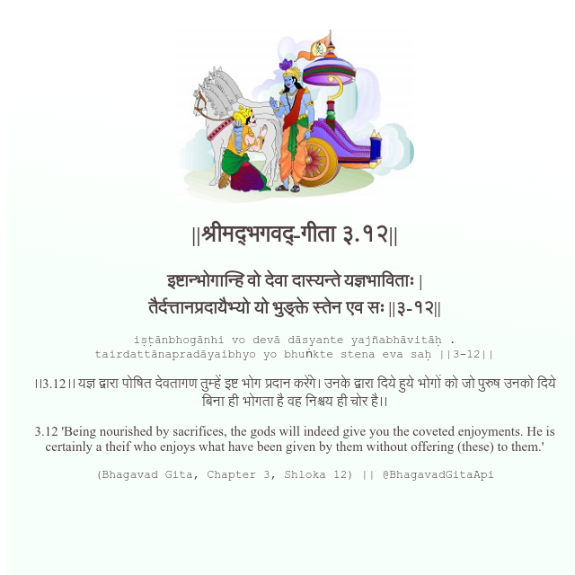

<h2>||श्रीमद्‍भगवद्‍-गीता ३.१२||</h2>
<h3>इष्टान्भोगान्हि वो देवा दास्यन्ते यज्ञभाविताः | तैर्दत्तानप्रदायैभ्यो यो भुङ्क्ते स्तेन एव सः ||३-१२||</h3>
<pre>iṣṭānbhogānhi vo devā dāsyante yajñabhāvitāḥ . tairdattānapradāyaibhyo yo bhuṅkte stena eva saḥ ||3-12||</pre>

।।3.12।। यज्ञ द्वारा पोषित देवतागण तुम्हें इष्ट भोग प्रदान करेंगे। उनके द्वारा दिये हुये भोगों को जो पुरुष उनको दिये बिना ही भोगता है वह निश्चय ही चोर है।।

<pre>(Bhagavad Gita, Chapter 3, Shloka 12) || @BhagavadGitaApi</pre>
https://docs.bhagavadgitaapi.in/

#API #bhagavadgitaapi #slok #nodejs #js #api #gitaapi #krishna #hinduism #vedic #ISKCON #shreemadbhagavadgita #technology

