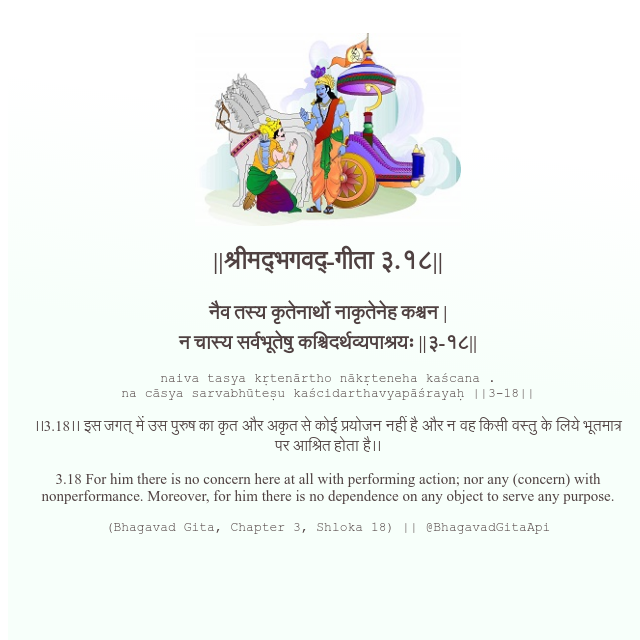

<h2>||श्रीमद्‍भगवद्‍-गीता ३.१८||</h2>
<h3>नैव तस्य कृतेनार्थो नाकृतेनेह कश्चन | न चास्य सर्वभूतेषु कश्चिदर्थव्यपाश्रयः ||३-१८||</h3>
<pre>naiva tasya kṛtenārtho nākṛteneha kaścana . na cāsya sarvabhūteṣu kaścidarthavyapāśrayaḥ ||3-18||</pre>

।।3.18।। इस जगत् में उस पुरुष का कृत और अकृत से कोई प्रयोजन नहीं है और न वह किसी वस्तु के लिये भूतमात्र पर आश्रित होता है।।

<pre>(Bhagavad Gita, Chapter 3, Shloka 18) || @BhagavadGitaApi</pre>
https://docs.bhagavadgitaapi.in/

#API #bhagavadgitaapi #slok #nodejs #js #api #gitaapi #krishna #hinduism #vedic #ISKCON #shreemadbhagavadgita #technology

