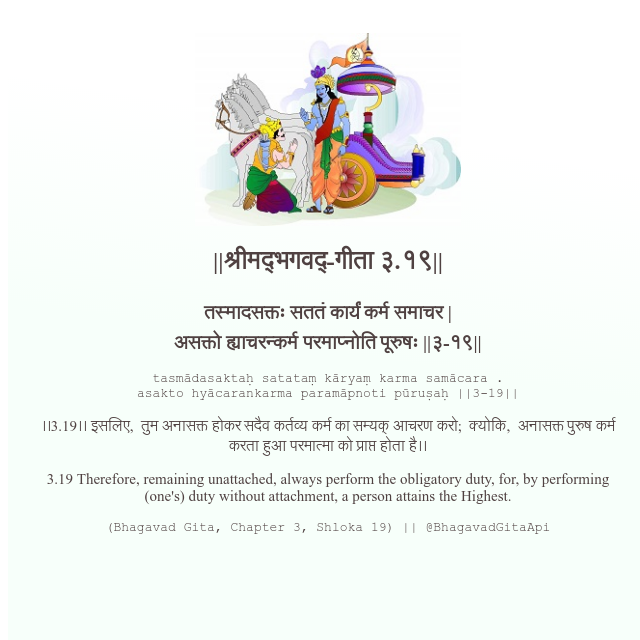

<h2>||श्रीमद्‍भगवद्‍-गीता ३.१९||</h2>
<h3>तस्मादसक्तः सततं कार्यं कर्म समाचर | असक्तो ह्याचरन्कर्म परमाप्नोति पूरुषः ||३-१९||</h3>
<pre>tasmādasaktaḥ satataṃ kāryaṃ karma samācara . asakto hyācarankarma paramāpnoti pūruṣaḥ ||3-19||</pre>

।।3.19।। इसलिए,  तुम अनासक्त होकर सदैव कर्तव्य कर्म का सम्यक् आचरण करो;  क्योकि,  अनासक्त पुरुष कर्म करता हुआ परमात्मा को प्राप्त होता है।।

<pre>(Bhagavad Gita, Chapter 3, Shloka 19) || @BhagavadGitaApi</pre>
https://bhagavadgitaapi.in/

#API #bhagavadgitaapi #slok #nodejs #js #api #gitaapi #krishna #hinduism #vedic #ISKCON #shreemadbhagavadgita #technology

