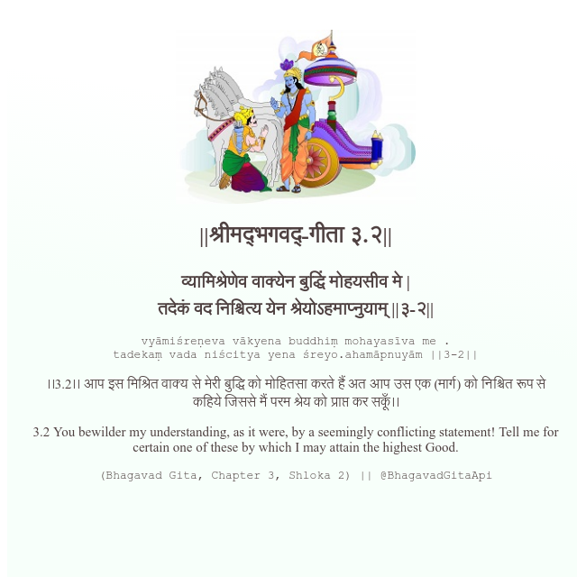

<h2>||श्रीमद्‍भगवद्‍-गीता ३.२||</h2>
<h3>व्यामिश्रेणेव वाक्येन बुद्धिं मोहयसीव मे | तदेकं वद निश्चित्य येन श्रेयोऽहमाप्नुयाम् ||३-२||</h3>
<pre>vyāmiśreṇeva vākyena buddhiṃ mohayasīva me . tadekaṃ vada niścitya yena śreyo.ahamāpnuyām ||3-2||</pre>

।।3.2।। आप इस मिश्रित वाक्य से मेरी बुद्धि को मोहितसा करते हैं अत आप उस एक (मार्ग) को निश्चित रूप से कहिये जिससे मैं परम श्रेय को प्राप्त कर सकूँ।।

<pre>(Bhagavad Gita, Chapter 3, Shloka 2) || @BhagavadGitaApi</pre>
https://docs.bhagavadgitaapi.in/

#API #bhagavadgitaapi #slok #nodejs #js #api #gitaapi #krishna #hinduism #vedic #ISKCON #shreemadbhagavadgita #technology

