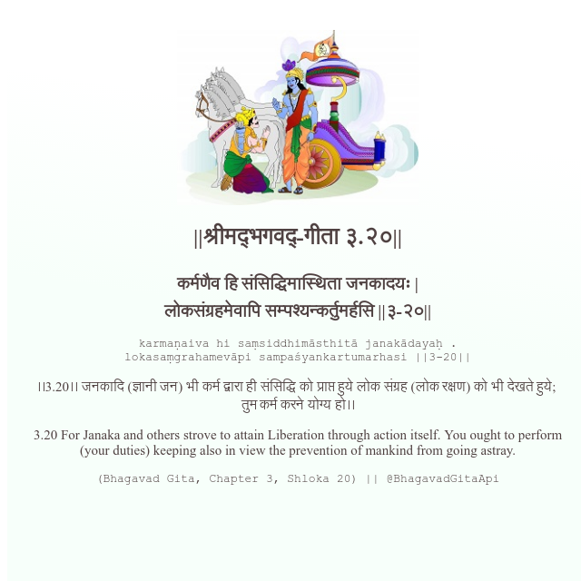

<h2>||श्रीमद्‍भगवद्‍-गीता ३.२०||</h2>
<h3>कर्मणैव हि संसिद्धिमास्थिता जनकादयः | लोकसंग्रहमेवापि सम्पश्यन्कर्तुमर्हसि ||३-२०||</h3>
<pre>karmaṇaiva hi saṃsiddhimāsthitā janakādayaḥ . lokasaṃgrahamevāpi sampaśyankartumarhasi ||3-20||</pre>

।।3.20।। जनकादि (ज्ञानी जन) भी कर्म द्वारा ही संसिद्धि को प्राप्त हुये लोक संग्रह (लोक रक्षण) को भी देखते हुये;  तुम कर्म करने योग्य हो।।

<pre>(Bhagavad Gita, Chapter 3, Shloka 20) || @BhagavadGitaApi</pre>
https://vedicscriptures.github.io/

#API #bhagavadgitaapi #slok #nodejs #js #api #gitaapi #krishna #hinduism #vedic #ISKCON #shreemadbhagavadgita #technology

