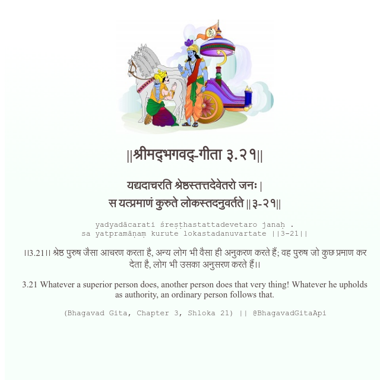

<h2>||श्रीमद्‍भगवद्‍-गीता ३.२१||</h2>
<h3>यद्यदाचरति श्रेष्ठस्तत्तदेवेतरो जनः | स यत्प्रमाणं कुरुते लोकस्तदनुवर्तते ||३-२१||</h3>
<pre>yadyadācarati śreṣṭhastattadevetaro janaḥ . sa yatpramāṇaṃ kurute lokastadanuvartate ||3-21||</pre>

।।3.21।। श्रेष्ठ पुरुष जैसा आचरण करता है, अन्य लोग भी वैसा ही अनुकरण करते हैं; वह पुरुष जो कुछ प्रमाण कर देता है, लोग भी उसका अनुसरण करते हैं।।

<pre>(Bhagavad Gita, Chapter 3, Shloka 21) || @BhagavadGitaApi</pre>
https://docs.bhagavadgitaapi.in/

#API #bhagavadgitaapi #slok #nodejs #js #api #gitaapi #krishna #hinduism #vedic #ISKCON #shreemadbhagavadgita #technology

