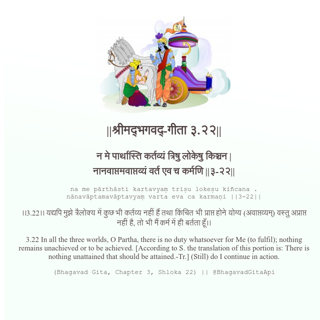

<h2>||श्रीमद्‍भगवद्‍-गीता ३.२२||</h2>
<h3>न मे पार्थास्ति कर्तव्यं त्रिषु लोकेषु किञ्चन | नानवाप्तमवाप्तव्यं वर्त एव च कर्मणि ||३-२२||</h3>
<pre>na me pārthāsti kartavyaṃ triṣu lokeṣu kiñcana . nānavāptamavāptavyaṃ varta eva ca karmaṇi ||3-22||</pre>

।।3.22।। यद्यपि मुझे त्रैलोक्य में कुछ भी कर्तव्य नहीं हैं तथा किंचित भी प्राप्त होने योग्य (अवाप्तव्यम्) वस्तु अप्राप्त नहीं है, तो भी मैं कर्म में ही बर्तता हूँ।।

<pre>(Bhagavad Gita, Chapter 3, Shloka 22) || @BhagavadGitaApi</pre>
https://bhagavadgitaapi.in/

#API #bhagavadgitaapi #slok #nodejs #js #api #gitaapi #krishna #hinduism #vedic #ISKCON #shreemadbhagavadgita #technology

