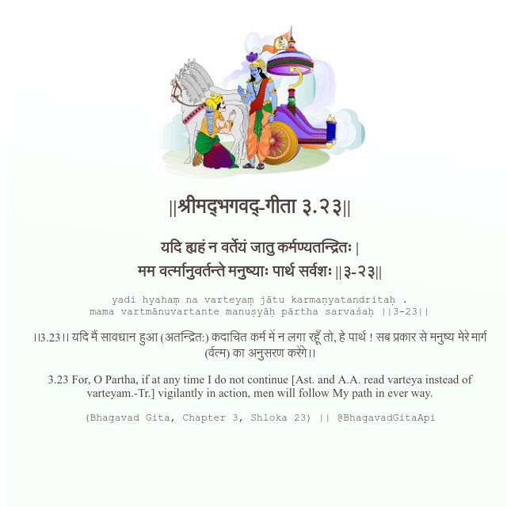

<h2>||श्रीमद्‍भगवद्‍-गीता ३.२३||</h2>
<h3>यदि ह्यहं न वर्तेयं जातु कर्मण्यतन्द्रितः | मम वर्त्मानुवर्तन्ते मनुष्याः पार्थ सर्वशः ||३-२३||</h3>
<pre>yadi hyahaṃ na varteyaṃ jātu karmaṇyatandritaḥ . mama vartmānuvartante manuṣyāḥ pārtha sarvaśaḥ ||3-23||</pre>

।।3.23।। यदि मैं सावधान हुआ (अतन्द्रित:) कदाचित कर्म में न लगा रहूँ तो, हे पार्थ ! सब प्रकार से मनुष्य मेरे मार्ग (र्वत्म) का अनुसरण करेंगे।।

<pre>(Bhagavad Gita, Chapter 3, Shloka 23) || @BhagavadGitaApi</pre>
https://bhagavadgitaapi.in/

#API #bhagavadgitaapi #slok #nodejs #js #api #gitaapi #krishna #hinduism #vedic #ISKCON #shreemadbhagavadgita #technology

