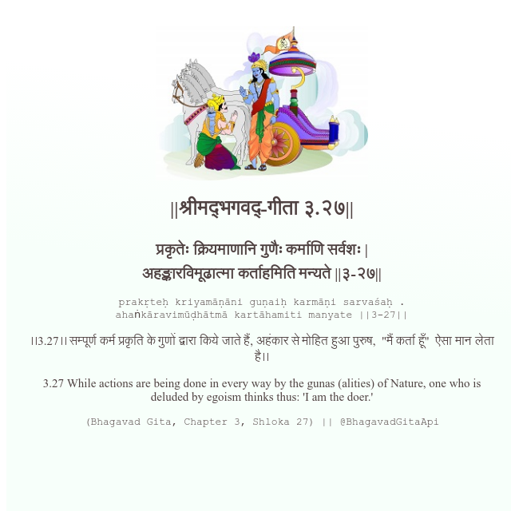

<h2>||श्रीमद्‍भगवद्‍-गीता ३.२७||</h2>
<h3>प्रकृतेः क्रियमाणानि गुणैः कर्माणि सर्वशः | अहङ्कारविमूढात्मा कर्ताहमिति मन्यते ||३-२७||</h3>
<pre>prakṛteḥ kriyamāṇāni guṇaiḥ karmāṇi sarvaśaḥ . ahaṅkāravimūḍhātmā kartāhamiti manyate ||3-27||</pre>

।।3.27।। सम्पूर्ण कर्म प्रकृति के गुणों द्वारा किये जाते हैं, अहंकार से मोहित हुआ पुरुष,  "मैं कर्ता हूँ"  ऐसा मान लेता है।।

<pre>(Bhagavad Gita, Chapter 3, Shloka 27) || @BhagavadGitaApi</pre>
https://vedicscriptures.github.io/

#API #bhagavadgitaapi #slok #nodejs #js #api #gitaapi #krishna #hinduism #vedic #ISKCON #shreemadbhagavadgita #technology

