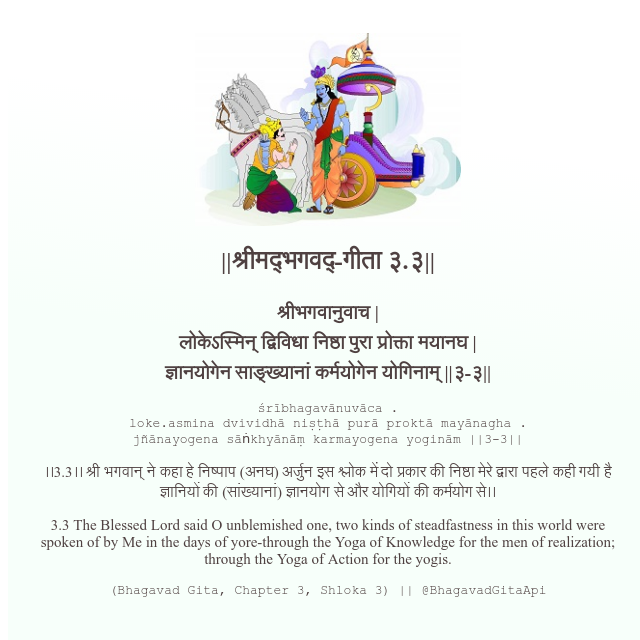

<h2>||श्रीमद्‍भगवद्‍-गीता ३.३||</h2>
<h3>श्रीभगवानुवाच | लोकेऽस्मिन् द्विविधा निष्ठा पुरा प्रोक्ता मयानघ | ज्ञानयोगेन साङ्ख्यानां कर्मयोगेन योगिनाम् ||३-३||</h3>
<pre>śrībhagavānuvāca . loke.asmina dvividhā niṣṭhā purā proktā mayānagha . jñānayogena sāṅkhyānāṃ karmayogena yoginām ||3-3||</pre>

।।3.3।। श्री भगवान् ने कहा  हे निष्पाप (अनघ) अर्जुन  इस श्लोक में दो प्रकार की निष्ठा मेरे द्वारा पहले कही गयी है ज्ञानियों की (सांख्यानां) ज्ञानयोग से और योगियों की कर्मयोग से।।

<pre>(Bhagavad Gita, Chapter 3, Shloka 3) || @BhagavadGitaApi</pre>
https://bhagavadgitaapi.in/

#API #bhagavadgitaapi #slok #nodejs #js #api #gitaapi #krishna #hinduism #vedic #ISKCON #shreemadbhagavadgita #technology

