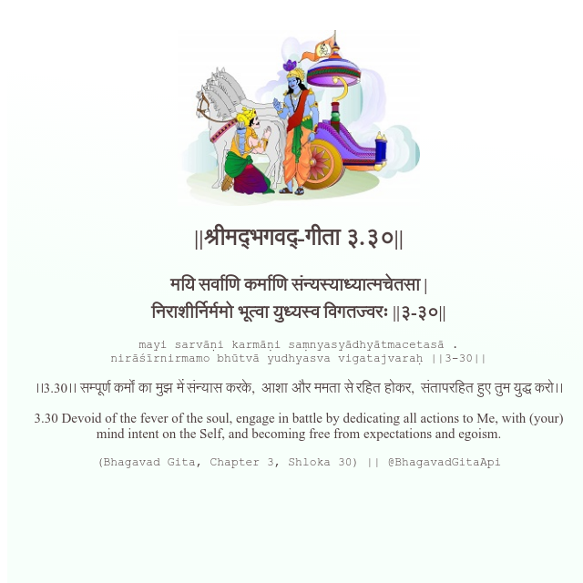

<h2>||श्रीमद्‍भगवद्‍-गीता ३.३०||</h2>
<h3>मयि सर्वाणि कर्माणि संन्यस्याध्यात्मचेतसा | निराशीर्निर्ममो भूत्वा युध्यस्व विगतज्वरः ||३-३०||</h3>
<pre>mayi sarvāṇi karmāṇi saṃnyasyādhyātmacetasā . nirāśīrnirmamo bhūtvā yudhyasva vigatajvaraḥ ||3-30||</pre>

।।3.30।। सम्पूर्ण कर्मों का मुझ में संन्यास करके,  आशा और ममता से रहित होकर,  संतापरहित हुए तुम युद्ध करो।।

<pre>(Bhagavad Gita, Chapter 3, Shloka 30) || @BhagavadGitaApi</pre>
https://vedicscriptures.github.io/

#API #bhagavadgitaapi #slok #nodejs #js #api #gitaapi #krishna #hinduism #vedic #ISKCON #shreemadbhagavadgita #technology

