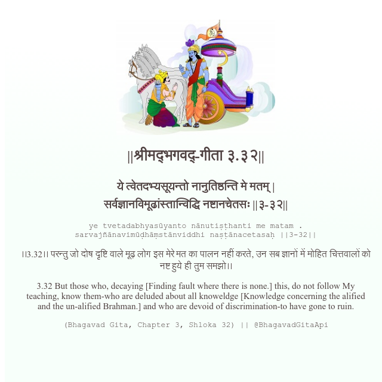

<h2>||श्रीमद्‍भगवद्‍-गीता ३.३२||</h2>
<h3>ये त्वेतदभ्यसूयन्तो नानुतिष्ठन्ति मे मतम् | सर्वज्ञानविमूढांस्तान्विद्धि नष्टानचेतसः ||३-३२||</h3>
<pre>ye tvetadabhyasūyanto nānutiṣṭhanti me matam . sarvajñānavimūḍhāṃstānviddhi naṣṭānacetasaḥ ||3-32||</pre>

।।3.32।। परन्तु जो दोष दृष्टि वाले मूढ़ लोग इस मेरे मत का पालन नहीं करते, उन सब ज्ञानों में मोहित चित्तवालों को नष्ट हुये ही तुम समझो।।

<pre>(Bhagavad Gita, Chapter 3, Shloka 32) || @BhagavadGitaApi</pre>
https://docs.bhagavadgitaapi.in/

#API #bhagavadgitaapi #slok #nodejs #js #api #gitaapi #krishna #hinduism #vedic #ISKCON #shreemadbhagavadgita #technology

