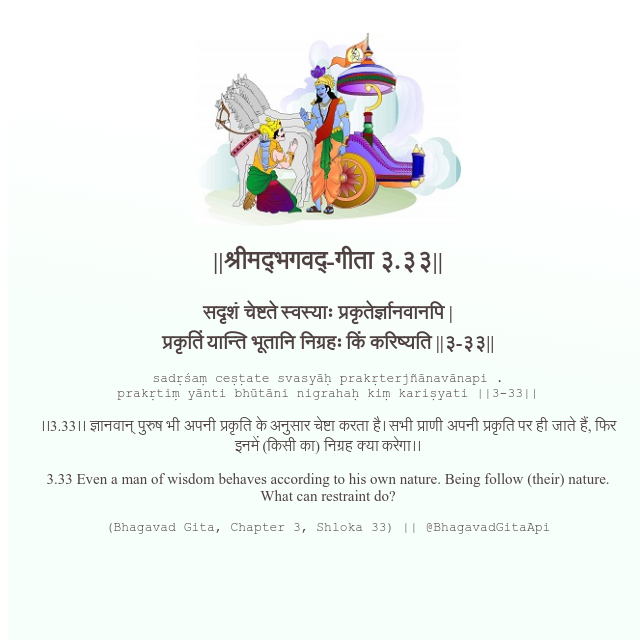

<h2>||श्रीमद्‍भगवद्‍-गीता ३.३३||</h2>
<h3>सदृशं चेष्टते स्वस्याः प्रकृतेर्ज्ञानवानपि | प्रकृतिं यान्ति भूतानि निग्रहः किं करिष्यति ||३-३३||</h3>
<pre>sadṛśaṃ ceṣṭate svasyāḥ prakṛterjñānavānapi . prakṛtiṃ yānti bhūtāni nigrahaḥ kiṃ kariṣyati ||3-33||</pre>

।।3.33।। ज्ञानवान् पुरुष भी अपनी प्रकृति के अनुसार चेष्टा करता है। सभी प्राणी अपनी प्रकृति पर ही जाते हैं, फिर इनमें (किसी का) निग्रह क्या करेगा।।

<pre>(Bhagavad Gita, Chapter 3, Shloka 33) || @BhagavadGitaApi</pre>
https://docs.bhagavadgitaapi.in/

#API #bhagavadgitaapi #slok #nodejs #js #api #gitaapi #krishna #hinduism #vedic #ISKCON #shreemadbhagavadgita #technology

