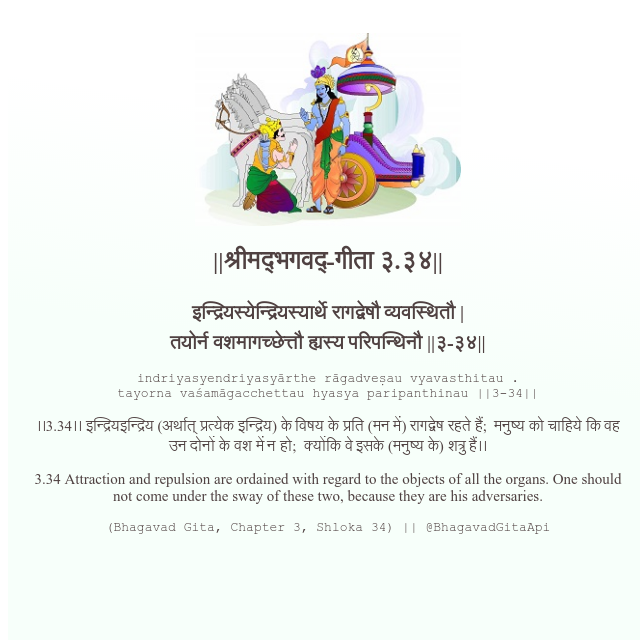

<h2>||श्रीमद्‍भगवद्‍-गीता ३.३४||</h2>
<h3>इन्द्रियस्येन्द्रियस्यार्थे रागद्वेषौ व्यवस्थितौ | तयोर्न वशमागच्छेत्तौ ह्यस्य परिपन्थिनौ ||३-३४||</h3>
<pre>indriyasyendriyasyārthe rāgadveṣau vyavasthitau . tayorna vaśamāgacchettau hyasya paripanthinau ||3-34||</pre>

।।3.34।। इन्द्रियइन्द्रिय (अर्थात् प्रत्येक इन्द्रिय) के विषय के प्रति (मन में) रागद्वेष रहते हैं;  मनुष्य को चाहिये कि वह उन दोनों के वश में न हो;  क्योंकि वे इसके (मनुष्य के) शत्रु हैं।।

<pre>(Bhagavad Gita, Chapter 3, Shloka 34) || @BhagavadGitaApi</pre>
https://bhagavadgitaapi.in/

#API #bhagavadgitaapi #slok #nodejs #js #api #gitaapi #krishna #hinduism #vedic #ISKCON #shreemadbhagavadgita #technology

