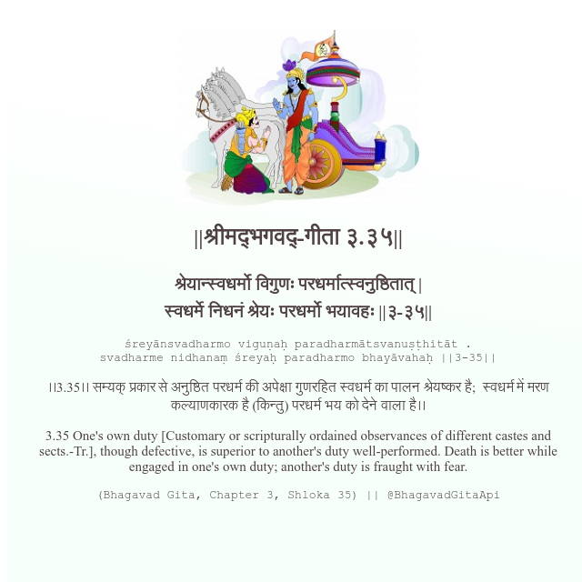

<h2>||श्रीमद्‍भगवद्‍-गीता ३.३५||</h2>
<h3>श्रेयान्स्वधर्मो विगुणः परधर्मात्स्वनुष्ठितात् | स्वधर्मे निधनं श्रेयः परधर्मो भयावहः ||३-३५||</h3>
<pre>śreyānsvadharmo viguṇaḥ paradharmātsvanuṣṭhitāt . svadharme nidhanaṃ śreyaḥ paradharmo bhayāvahaḥ ||3-35||</pre>

।।3.35।। सम्यक् प्रकार से अनुष्ठित परधर्म की अपेक्षा गुणरहित स्वधर्म का पालन श्रेयष्कर है;  स्वधर्म में मरण कल्याणकारक है (किन्तु) परधर्म भय को देने वाला है।।

<pre>(Bhagavad Gita, Chapter 3, Shloka 35) || @BhagavadGitaApi</pre>
https://docs.bhagavadgitaapi.in/

#API #bhagavadgitaapi #slok #nodejs #js #api #gitaapi #krishna #hinduism #vedic #ISKCON #shreemadbhagavadgita #technology

