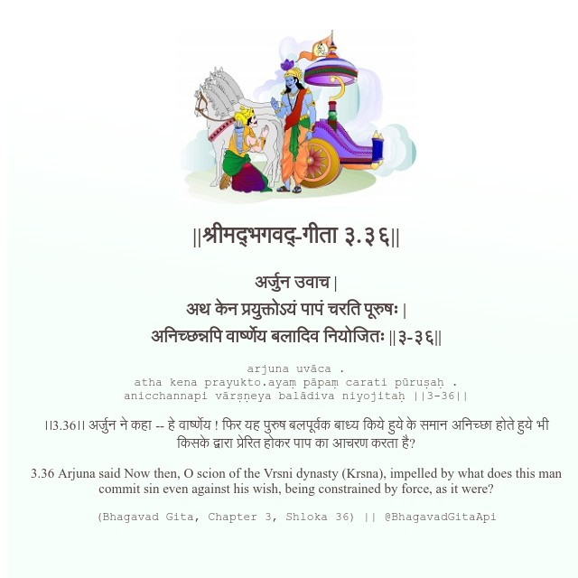

<h2>||श्रीमद्‍भगवद्‍-गीता ३.३६||</h2>
<h3>अर्जुन उवाच | अथ केन प्रयुक्तोऽयं पापं चरति पूरुषः | अनिच्छन्नपि वार्ष्णेय बलादिव नियोजितः ||३-३६||</h3>
<pre>arjuna uvāca . atha kena prayukto.ayaṃ pāpaṃ carati pūruṣaḥ . anicchannapi vārṣṇeya balādiva niyojitaḥ ||3-36||</pre>

।।3.36।। अर्जुन ने कहा -- हे वार्ष्णेय ! फिर यह पुरुष बलपूर्वक बाध्य किये हुये के समान अनिच्छा होते हुये भी किसके द्वारा प्रेरित होकर पाप का आचरण करता है?

<pre>(Bhagavad Gita, Chapter 3, Shloka 36) || @BhagavadGitaApi</pre>
https://vedicscriptures.github.io/

#API #bhagavadgitaapi #slok #nodejs #js #api #gitaapi #krishna #hinduism #vedic #ISKCON #shreemadbhagavadgita #technology

