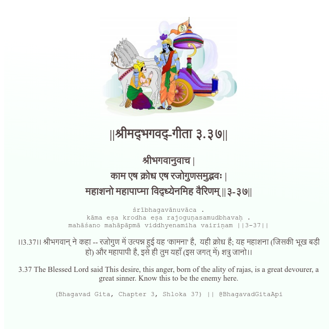

<h2>||श्रीमद्‍भगवद्‍-गीता ३.३७||</h2>
<h3>श्रीभगवानुवाच | काम एष क्रोध एष रजोगुणसमुद्भवः | महाशनो महापाप्मा विद्ध्येनमिह वैरिणम् ||३-३७||</h3>
<pre>śrībhagavānuvāca . kāma eṣa krodha eṣa rajoguṇasamudbhavaḥ . mahāśano mahāpāpmā viddhyenamiha vairiṇam ||3-37||</pre>

।।3.37।। श्रीभगवान् ने कहा -- रजोगुण में उत्पन्न हुई यह 'कामना' है,  यही क्रोध है; यह महाशना (जिसकी भूख बड़ी हो) और महापापी है, इसे ही तुम यहाँ (इस जगत् में) शत्रु जानो।।

<pre>(Bhagavad Gita, Chapter 3, Shloka 37) || @BhagavadGitaApi</pre>
https://bhagavadgitaapi.in/

#API #bhagavadgitaapi #slok #nodejs #js #api #gitaapi #krishna #hinduism #vedic #ISKCON #shreemadbhagavadgita #technology

