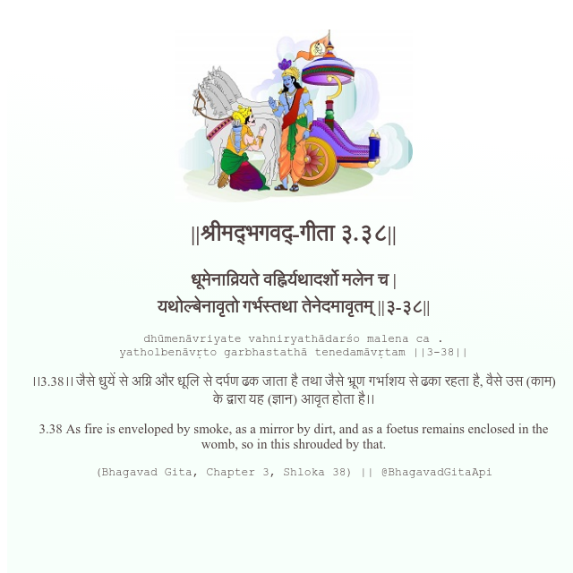

<h2>||श्रीमद्‍भगवद्‍-गीता ३.३८||</h2>
<h3>धूमेनाव्रियते वह्निर्यथादर्शो मलेन च | यथोल्बेनावृतो गर्भस्तथा तेनेदमावृतम् ||३-३८||</h3>
<pre>dhūmenāvriyate vahniryathādarśo malena ca . yatholbenāvṛto garbhastathā tenedamāvṛtam ||3-38||</pre>

।।3.38।। जैसे धुयें से अग्नि और धूलि से दर्पण ढक जाता है तथा जैसे भ्रूण गर्भाशय से ढका रहता है, वैसे उस (काम) के द्वारा यह (ज्ञान) आवृत होता है।।

<pre>(Bhagavad Gita, Chapter 3, Shloka 38) || @BhagavadGitaApi</pre>
https://bhagavadgitaapi.in/

#API #bhagavadgitaapi #slok #nodejs #js #api #gitaapi #krishna #hinduism #vedic #ISKCON #shreemadbhagavadgita #technology

