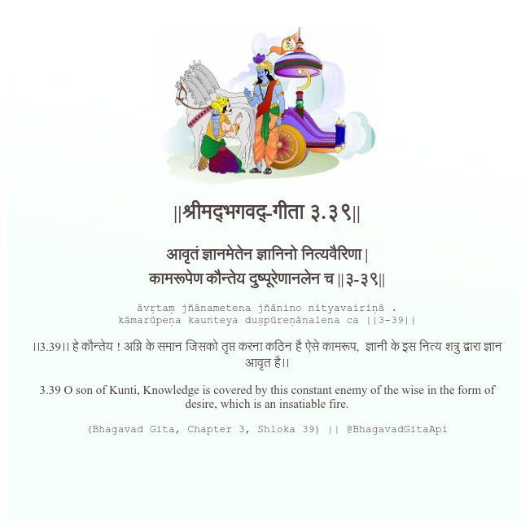

<h2>||श्रीमद्‍भगवद्‍-गीता ३.३९||</h2>
<h3>आवृतं ज्ञानमेतेन ज्ञानिनो नित्यवैरिणा | कामरूपेण कौन्तेय दुष्पूरेणानलेन च ||३-३९||</h3>
<pre>āvṛtaṃ jñānametena jñānino nityavairiṇā . kāmarūpeṇa kaunteya duṣpūreṇānalena ca ||3-39||</pre>

।।3.39।। हे कौन्तेय ! अग्नि के समान जिसको तृप्त करना कठिन है ऐसे कामरूप,  ज्ञानी के इस नित्य शत्रु द्वारा ज्ञान आवृत है।।

<pre>(Bhagavad Gita, Chapter 3, Shloka 39) || @BhagavadGitaApi</pre>
https://bhagavadgitaapi.in/

#API #bhagavadgitaapi #slok #nodejs #js #api #gitaapi #krishna #hinduism #vedic #ISKCON #shreemadbhagavadgita #technology

