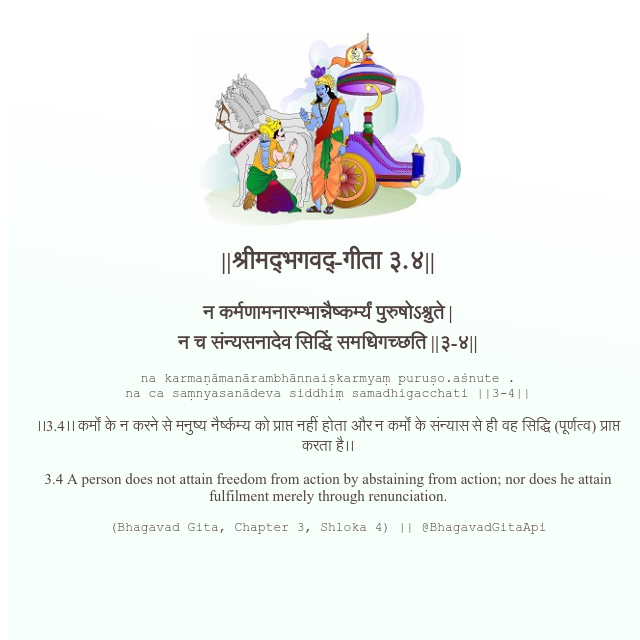

<h2>||श्रीमद्‍भगवद्‍-गीता ३.४||</h2>
<h3>न कर्मणामनारम्भान्नैष्कर्म्यं पुरुषोऽश्नुते | न च संन्यसनादेव सिद्धिं समधिगच्छति ||३-४||</h3>
<pre>na karmaṇāmanārambhānnaiṣkarmyaṃ puruṣo.aśnute . na ca saṃnyasanādeva siddhiṃ samadhigacchati ||3-4||</pre>

।।3.4।। कर्मों के न करने से मनुष्य नैर्ष्कम्य को प्राप्त नहीं होता और न कर्मों के संन्यास से ही वह सिद्धि (पूर्णत्व) प्राप्त करता है।।

<pre>(Bhagavad Gita, Chapter 3, Shloka 4) || @BhagavadGitaApi</pre>
https://bhagavadgitaapi.in/

#API #bhagavadgitaapi #slok #nodejs #js #api #gitaapi #krishna #hinduism #vedic #ISKCON #shreemadbhagavadgita #technology

