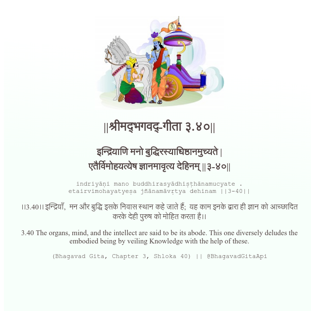

<h2>||श्रीमद्‍भगवद्‍-गीता ३.४०||</h2>
<h3>इन्द्रियाणि मनो बुद्धिरस्याधिष्ठानमुच्यते | एतैर्विमोहयत्येष ज्ञानमावृत्य देहिनम् ||३-४०||</h3>
<pre>indriyāṇi mano buddhirasyādhiṣṭhānamucyate . etairvimohayatyeṣa jñānamāvṛtya dehinam ||3-40||</pre>

।।3.40।। इन्द्रियाँ,  मन और बुद्धि इसके निवास स्थान कहे जाते हैं;  यह काम इनके द्वारा ही ज्ञान को आच्छादित करके देही पुरुष को मोहित करता है।।

<pre>(Bhagavad Gita, Chapter 3, Shloka 40) || @BhagavadGitaApi</pre>
https://vedicscriptures.github.io/

#API #bhagavadgitaapi #slok #nodejs #js #api #gitaapi #krishna #hinduism #vedic #ISKCON #shreemadbhagavadgita #technology

