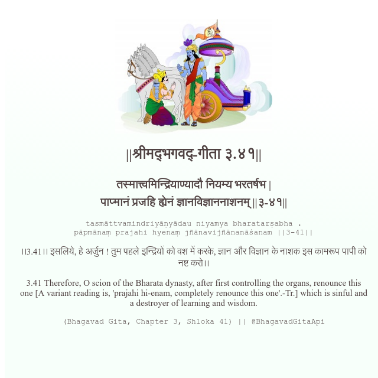

<h2>||श्रीमद्‍भगवद्‍-गीता ३.४१||</h2>
<h3>तस्मात्त्वमिन्द्रियाण्यादौ नियम्य भरतर्षभ | पाप्मानं प्रजहि ह्येनं ज्ञानविज्ञाननाशनम् ||३-४१||</h3>
<pre>tasmāttvamindriyāṇyādau niyamya bharatarṣabha . pāpmānaṃ prajahi hyenaṃ jñānavijñānanāśanam ||3-41||</pre>

।।3.41।। इसलिये, हे अर्जुन ! तुम पहले इन्द्रियों को वश में करके, ज्ञान और विज्ञान के नाशक इस कामरूप पापी को नष्ट करो।।

<pre>(Bhagavad Gita, Chapter 3, Shloka 41) || @BhagavadGitaApi</pre>
https://bhagavadgitaapi.in/

#API #bhagavadgitaapi #slok #nodejs #js #api #gitaapi #krishna #hinduism #vedic #ISKCON #shreemadbhagavadgita #technology

