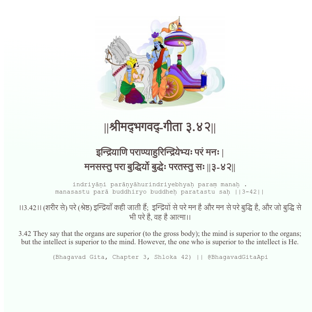

<h2>||श्रीमद्‍भगवद्‍-गीता ३.४२||</h2>
<h3>इन्द्रियाणि पराण्याहुरिन्द्रियेभ्यः परं मनः | मनसस्तु परा बुद्धिर्यो बुद्धेः परतस्तु सः ||३-४२||</h3>
<pre>indriyāṇi parāṇyāhurindriyebhyaḥ paraṃ manaḥ . manasastu parā buddhiryo buddheḥ paratastu saḥ ||3-42||</pre>

।।3.42।। (शरीर से) परे (श्रेष्ठ) इन्द्रियाँ कही जाती हैं;  इन्द्रियों से परे मन है और मन से परे बुद्धि है, और जो बुद्धि से भी परे है, वह है आत्मा।।

<pre>(Bhagavad Gita, Chapter 3, Shloka 42) || @BhagavadGitaApi</pre>
https://vedicscriptures.github.io/

#API #bhagavadgitaapi #slok #nodejs #js #api #gitaapi #krishna #hinduism #vedic #ISKCON #shreemadbhagavadgita #technology

