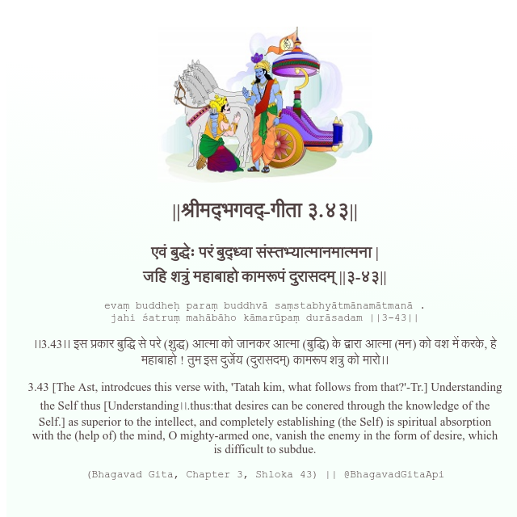

<h2>||श्रीमद्‍भगवद्‍-गीता ३.४३||</h2>
<h3>एवं बुद्धेः परं बुद्ध्वा संस्तभ्यात्मानमात्मना | जहि शत्रुं महाबाहो कामरूपं दुरासदम् ||३-४३||</h3>
<pre>evaṃ buddheḥ paraṃ buddhvā saṃstabhyātmānamātmanā . jahi śatruṃ mahābāho kāmarūpaṃ durāsadam ||3-43||</pre>

।।3.43।। इस प्रकार बुद्धि से परे (शुद्ध) आत्मा को जानकर आत्मा (बुद्धि) के द्वारा आत्मा (मन) को वश में करके, हे महाबाहो ! तुम इस दुर्जेय (दुरासदम्) कामरूप शत्रु को मारो।।

<pre>(Bhagavad Gita, Chapter 3, Shloka 43) || @BhagavadGitaApi</pre>
https://docs.bhagavadgitaapi.in/

#API #bhagavadgitaapi #slok #nodejs #js #api #gitaapi #krishna #hinduism #vedic #ISKCON #shreemadbhagavadgita #technology

