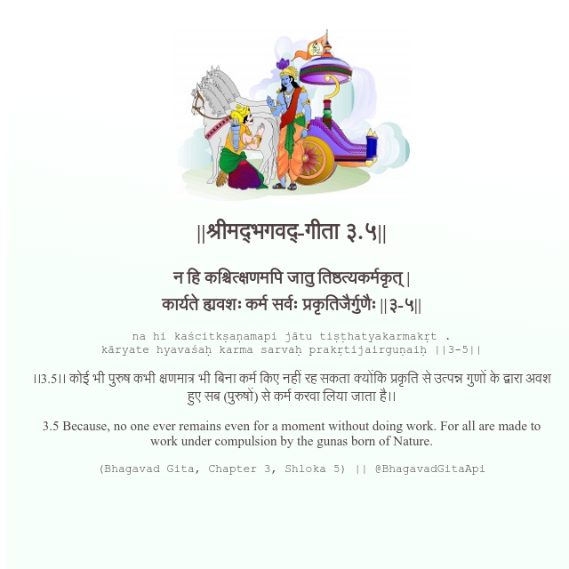

<h2>||श्रीमद्‍भगवद्‍-गीता ३.५||</h2>
<h3>न हि कश्चित्क्षणमपि जातु तिष्ठत्यकर्मकृत् | कार्यते ह्यवशः कर्म सर्वः प्रकृतिजैर्गुणैः ||३-५||</h3>
<pre>na hi kaścitkṣaṇamapi jātu tiṣṭhatyakarmakṛt . kāryate hyavaśaḥ karma sarvaḥ prakṛtijairguṇaiḥ ||3-5||</pre>

।।3.5।। कोई भी पुरुष कभी क्षणमात्र भी बिना कर्म किए नहीं रह सकता क्योंकि प्रकृति से उत्पन्न गुणों के द्वारा अवश हुए सब (पुरुषों) से कर्म करवा लिया जाता है।।

<pre>(Bhagavad Gita, Chapter 3, Shloka 5) || @BhagavadGitaApi</pre>
https://docs.bhagavadgitaapi.in/

#API #bhagavadgitaapi #slok #nodejs #js #api #gitaapi #krishna #hinduism #vedic #ISKCON #shreemadbhagavadgita #technology

