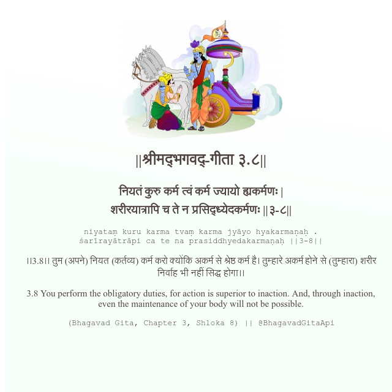

<h2>||श्रीमद्‍भगवद्‍-गीता ३.८||</h2>
<h3>नियतं कुरु कर्म त्वं कर्म ज्यायो ह्यकर्मणः | शरीरयात्रापि च ते न प्रसिद्ध्येदकर्मणः ||३-८||</h3>
<pre>niyataṃ kuru karma tvaṃ karma jyāyo hyakarmaṇaḥ . śarīrayātrāpi ca te na prasiddhyedakarmaṇaḥ ||3-8||</pre>

।।3.8।। तुम (अपने) नियत (कर्तव्य) कर्म करो क्योंकि अकर्म से श्रेष्ठ कर्म है। तुम्हारे अकर्म होने से (तुम्हारा) शरीर निर्वाह भी नहीं सिद्ध होगा।।

<pre>(Bhagavad Gita, Chapter 3, Shloka 8) || @BhagavadGitaApi</pre>
https://docs.bhagavadgitaapi.in/

#API #bhagavadgitaapi #slok #nodejs #js #api #gitaapi #krishna #hinduism #vedic #ISKCON #shreemadbhagavadgita #technology

