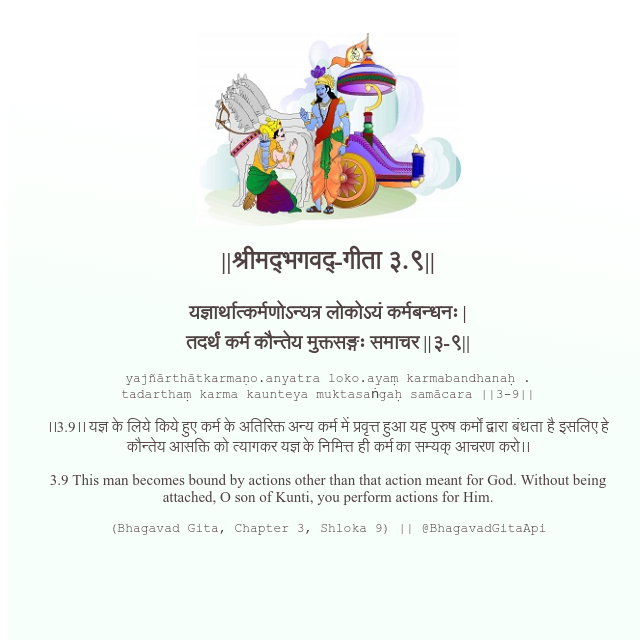

<h2>||श्रीमद्‍भगवद्‍-गीता ३.९||</h2>
<h3>यज्ञार्थात्कर्मणोऽन्यत्र लोकोऽयं कर्मबन्धनः | तदर्थं कर्म कौन्तेय मुक्तसङ्गः समाचर ||३-९||</h3>
<pre>yajñārthātkarmaṇo.anyatra loko.ayaṃ karmabandhanaḥ . tadarthaṃ karma kaunteya muktasaṅgaḥ samācara ||3-9||</pre>

।।3.9।। यज्ञ के लिये किये हुए कर्म के अतिरिक्त अन्य कर्म में प्रवृत्त हुआ यह पुरुष कर्मों द्वारा बंधता है इसलिए हे कौन्तेय आसक्ति को त्यागकर यज्ञ के निमित्त ही कर्म का सम्यक् आचरण करो।।

<pre>(Bhagavad Gita, Chapter 3, Shloka 9) || @BhagavadGitaApi</pre>
https://vedicscriptures.github.io/

#API #bhagavadgitaapi #slok #nodejs #js #api #gitaapi #krishna #hinduism #vedic #ISKCON #shreemadbhagavadgita #technology

